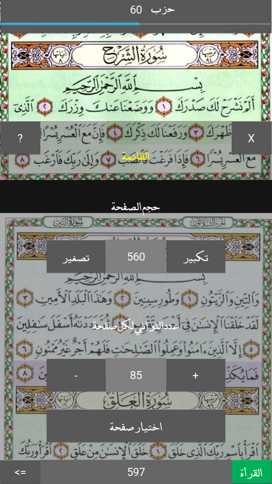

# Quran-tin
simple app for reading Quran with auto-scroll coded with Python and Kivy

## utilities used

Python 2.7 + Kivy 1.9.0 : language and framework used for coding

Piskel 0.14.0 : for drawing icons in pixelart style

Buildozer 0.34 : for apk and ios build, only for linux (tested on Ubuntu 16.10)

## build

### run app

install kivy if not done yet

run :

main.py with python

### mobile packaging

install buildozer if not done yet
this step is only for linux
in the app dir run:

init buildozer

buildozer -v android debug

mv .buildozer/android/platform/build/dists/Quran/bin/Quran-tin-0.1-debug.apk .

## version list

correct hizb barre calculation	v0.11*

correct stop/read method	v0.10

display colors legend		v0.9

display current hizb		v0.8

code more eficient number input	v0.7

correcte app power glutonary	v0.6

translate app text to arabic	v0.5

correcte scroll calculation	v0.4

design stable menu		v0.3

auto-saving session		v0.2

adapt build from python to kv 	v0.1

## what next?

imropve menu ergonomie

## contributions are welcome

for more informations or any suggestion, contribution and others contact me in faisal.adraji@gmail.com
